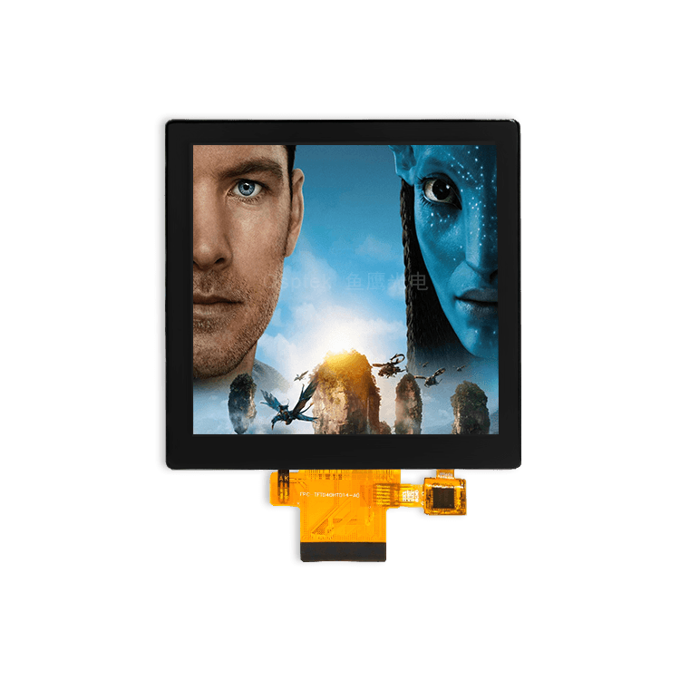

<p align="left"></p>

<h1 align="center">OSPTEK 3.95″ TFT 480×480 (ST7701 · RGB)</h1>

<p align="center"><b>Square TFT module · RGB · ST7701</b></p>

<p align="center"><a href="./README.md">简体中文</a> | English</p>

<p align="center">
  
  
  
  
</p>

<p align="center"></p>

## Contents

- [Overview](#overview)
- [Specifications](#specifications)
- [Sample projects](#sample-projects)
- [Repository layout](#repository-layout)
- [Resources](#resources)
- [Buy](#buy)
- [Support](#support)

---

## Overview

OSPTEK **3.95″ 480×480 TFT** is an **RGB** color display module driven by **ST7701S** (panel init over 3-wire SPI), with touch controller **FT6336U**. It suits square HMI, instruments, and mid-size interactive panels.

Spec ID (repository name): `3.95-tft-480x480-rgb-st7701`

Current module version: **YDP395BT003-V4**. Electrical and mechanical details follow [`docs/YDP395BT003-V4.pdf`](./docs/YDP395BT003-V4.pdf).

## Specifications

| Item | Spec |
| ---- | ---- |
| Size | 3.95 inch |
| Type | TFT / IPS (color) |
| Resolution | 480×480 |
| Interface | RGB 18-bit (init: 3-wire SPI) |
| Driver IC | ST7701S |
| Touch IC | FT6336U |

> Full outline, FPC definition, power, and timing follow the product datasheet / driver IC datasheet.

## Sample projects

| Description | Path |
| ---- | ---- |
| ESP32-S3 · ST7701 RGB + LVGL9 (touch FT6336U, `esp_lcd_touch_ft6336u`) | [`examples/esp32s3-3.95-tft-480x480-rgb-st7701-bringup/`](./examples/esp32s3-3.95-tft-480x480-rgb-st7701-bringup/) |

## Repository layout

```text
3.95-tft-480x480-rgb-st7701/
├── README.md
├── README_EN.md
├── MODULE_VERSION.md
├── LICENSE
├── images/          # README assets
├── docs/            # datasheets, init, CAD
└── examples/        # sample projects
```

## Resources

### Product files

| Resource | Link |
| ---- | ---- |
| Product datasheet (YDP395BT003-V4) | [`docs/YDP395BT003-V4.pdf`](./docs/YDP395BT003-V4.pdf) |
| Assembly CAD (YDP395BT003-V4) | [`docs/YDP395BT003-V4.dwg`](./docs/YDP395BT003-V4.dwg) |
| Driver IC datasheet (ST7701S) | [`docs/ST7701S_SPEC_V1.3.pdf`](./docs/ST7701S_SPEC_V1.3.pdf) |
| Touch IC datasheet (FT6336U) | [`docs/FT6336U_DataSheet_V1.1.pdf`](./docs/FT6336U_DataSheet_V1.1.pdf) |
| Init sequence (text) | [`docs/BOE3.95_480x480_ST7701S_init.txt`](./docs/BOE3.95_480x480_ST7701S_init.txt) |

### Samples

- [ESP32-S3 ST7701 RGB + LVGL9](./examples/esp32s3-3.95-tft-480x480-rgb-st7701-bringup/)

## Buy

<p align="center">
  <a href="https://www.aliexpress.com/store/1105701619"></a>
  &nbsp;&nbsp;
  <a href="https://shop110742373.taobao.com/"></a>
</p>

**Overseas (AliExpress)**

- Store: [OSPTEK Official Store](https://www.aliexpress.com/store/1105701619)

**China (Taobao)**

- Store: [鱼鹰光电工厂店](https://shop110742373.taobao.com/)

## Support

- Technical support / product inquiry: <luyu@osptek.com>
- QQ group (China): **985881096**
- Website: <https://osptek.com/>
- Feel free to open an Issue in this repository if you have any questions

---

<p align="center"><sub>© 2026 OSPTEK · Materials in this repository are licensed under CC BY 4.0</sub></p>
